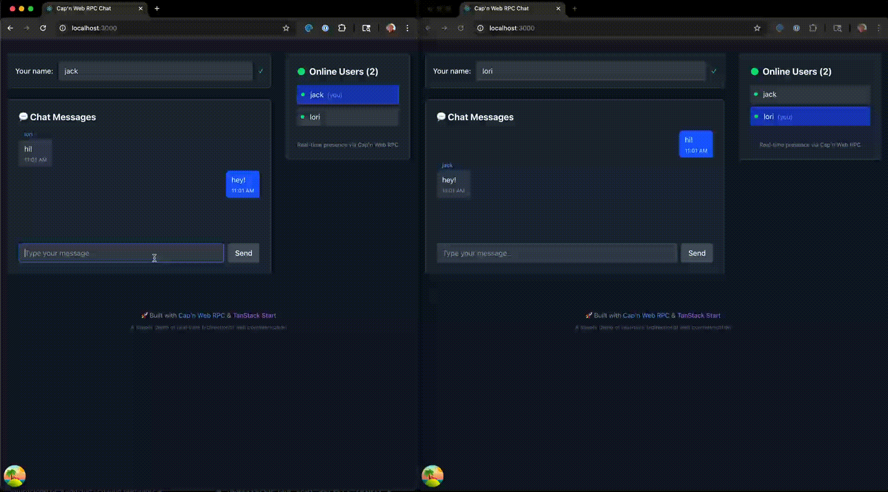

# Cap'n Web Chat Demo

A real-time multi-user chat application demonstrating the integration of **Cap'n Web RPC** with **TanStack Start**. This project showcases bidirectional WebSocket communication, server-side rendering, and modern React patterns.

## 🎥 Demo



## ✨ Features

- **Real-time messaging** - Instant message delivery across all connected users
- **Online presence** - See who's currently in the chat
- **Auto-connection** - Seamlessly connects when the page loads
- **Responsive design** - Works on desktop and mobile devices
- **Modern chat UI** - Messages appear like iMessage/WhatsApp (yours on right, others on left)
- **Username-based** - Simple username entry, no registration required

## 🏗️ Architecture

This demo combines several powerful technologies:

- **[Cap'n Web RPC](https://github.com/cloudflare/capnweb)** - Bidirectional RPC over WebSockets
- **[TanStack Start](https://tanstack.com/start)** - Full-stack React framework
- **[TanStack Router](https://tanstack.com/router)** - Type-safe routing
- **[Tailwind CSS](https://tailwindcss.com/)** - Utility-first styling
- **WebSocket Server** - Real-time communication layer

### Key Components

```
chat-server/
├── chat-logic.ts      # Core chat business logic
├── capnweb-rpc.ts     # Cap'n Web RPC server implementation
└── vite-plugin.ts     # WebSocket integration with Vite

src/
├── components/
│   ├── ChatInterface.tsx    # Main chat message display
│   ├── OnlineUsers.tsx      # Online user list
│   └── UsernameInput.tsx    # Username entry
├── hooks/
│   ├── useChatConnection.ts # WebSocket connection management
│   └── useChatMessages.ts   # Message state and polling
└── routes/
    └── index.tsx           # Main chat page
```

## 🚀 Getting Started

### Prerequisites

- Node.js 18+
- pnpm (recommended) or npm

### Installation

```bash
# Clone the repository
git clone <repo-url>
cd capnweb-chat-demo

# Install dependencies
pnpm install
```

### Development

```bash
# Start the development server
pnpm dev
```

Open [http://localhost:3000](http://localhost:3000) in multiple browser tabs to test the chat functionality.

### Building for Production

```bash
# Build the application
pnpm build

# Start production server
pnpm start
```

## 💬 How It Works

### 1. **Connection Flow**

- User opens the chat page
- Application auto-connects to WebSocket server via Cap'n Web RPC
- Connection status is managed transparently

### 2. **Chat Flow**

- User enters a username
- Application automatically joins the chat room
- Messages are sent via RPC calls to the server
- Server broadcasts messages to all connected users
- Client polls for new messages every second

### 3. **Message Broadcasting**

```typescript
// Server-side message broadcasting
await ChatServer.broadcastToAll({
  type: "message",
  message: message.message,
  username: message.username,
  timestamp: message.timestamp,
  id: message.id,
});
```

### 4. **Real-time Updates**

- **Messages**: Polled every 1 second
- **Online users**: Updated every 5 seconds
- **Connection status**: Real-time via WebSocket events

## 🔧 Configuration

### WebSocket Setup

The WebSocket server is configured in `chat-server/vite-plugin.ts`:

```typescript
// WebSocket endpoint: /api/websocket
wss.handleUpgrade(request, socket, head, (ws) => {
  const chatServer = new ChatServer();
  chatServer.setWebSocket(ws);
  newWebSocketRpcSession(ws, chatServer);
});
```

### Message Queue System

Messages are queued per user to ensure delivery:

```typescript
// Each user gets their own message queue
export const userMessageQueues = new Map<string, Array<any>>();

// Messages are polled and cleared
const messages = userMessageQueues.get(username) || [];
userMessageQueues.set(username, []); // Clear after reading
```

## 🧪 Testing

```bash
# Run tests
pnpm test
```

To test the chat functionality:

1. Open multiple browser tabs to [http://localhost:3000](http://localhost:3000)
2. Enter different usernames in each tab
3. Send messages and observe real-time delivery
4. Check the online users list updates

## 📚 Key Technologies Explained

### Cap'n Web RPC

- **Bidirectional**: Both client and server can call methods on each other
- **Type-safe**: Full TypeScript support for RPC calls
- **WebSocket-based**: Built on standard WebSocket protocol
- **Efficient**: Binary protocol with message queuing

### TanStack Start

- **Full-stack**: Single framework for client and server
- **Server-side rendering**: Pages render on the server first
- **File-based routing**: Routes defined by file structure
- **Type-safe**: End-to-end TypeScript support

### Message Flow

```
User types message
    ↓
useChatMessages.sendMessage()
    ↓
Cap'n Web RPC call
    ↓
ChatServer.sendMessage()
    ↓
ChatLogic.sendMessage()
    ↓
Broadcast to all users
    ↓
Message queues updated
    ↓
Clients poll for updates
    ↓
UI updates with new message
```

## 🎯 Why This Demo?

This application demonstrates:

1. **Real-world WebSocket usage** - Not just a simple echo server
2. **RPC over WebSockets** - More structured than plain message passing
3. **Modern React patterns** - Hooks, effects, and clean component architecture
4. **Full-stack TypeScript** - Shared types between client and server
5. **Production-ready patterns** - Error handling, reconnection, message queuing

Perfect for learning how to build real-time applications with modern web technologies!

## 🤝 Contributing

This is a demonstration project, but improvements are welcome:

- Enhanced error handling
- Message persistence
- User authentication
- Private messaging
- File sharing
- Emoji reactions

## 📄 License

This project is open source and available under the [MIT License](LICENSE).

---

**Built with ❤️ using Cap'n Web RPC and TanStack Start**
